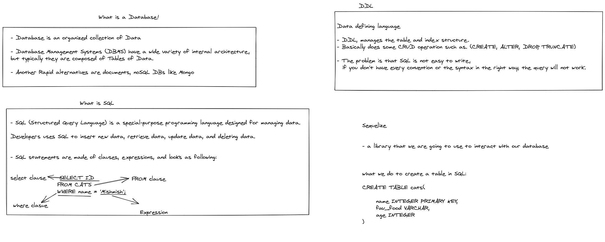

# LAB04 - Data Modeling
Bayan Qutshan

* [Github actions](https://github.com/BianQt/api-server/actions/runs/1417270148)
* [Pull-Request](https://github.com/BianQt/api-server/pull/1)
* [bianqt-api-server](https://bianqt-api-server.herokuapp.com/)

## Setup
```.env``` requirements
```PORT``` - Port Number
```DATABASE_URL```- Database URL

## Running the app
```npm start``` / ```npm run dev```

## Tests
Unit Tests: npm run test
Lint Tests: npm run lint

## Notes

